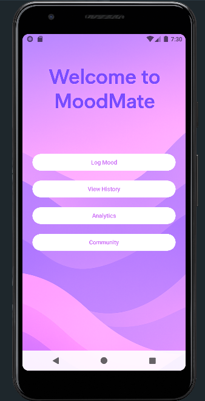
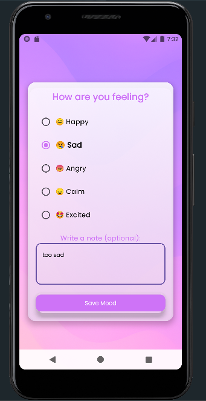
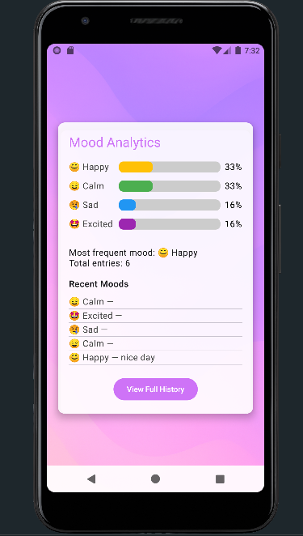
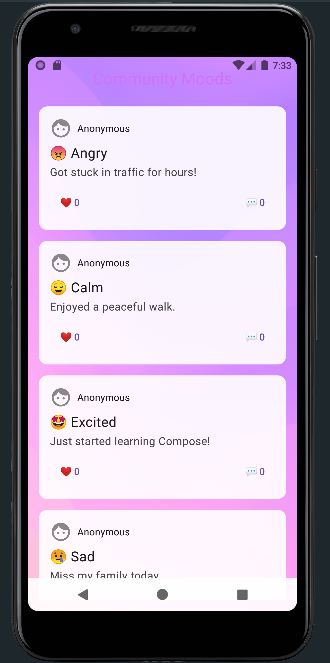

<<<<<<< HEAD
# MoodMate-app
=======


# 🌈 MoodMate

MoodMate is an Android app built with **Jetpack Compose**, **Firebase**, and **MVVM architecture**. It helps you track your moods, understand your emotional trends with analytics, and connect with a community.

---

## ✨ Features

- ✅ **Log Moods** — Choose your current mood and add an optional note.
- 📊 **Mood Analytics** — See your mood trends visually with animated bars.
- 📚 **Mood History** — View all your past moods in a clean, aesthetic list.
- 🌍 **Community Screen** — Share moods publicly, like and comment on others' posts.
- 🎨 **Aesthetic UI** — Modern design using Compose and Material 3, with smooth animations and backgrounds.

---

## 🧑‍💻 Tech Stack

- **Kotlin 2.0**
- **Jetpack Compose**
- **Firebase Firestore & Analytics**
- **MVVM Architecture**
- **Vico Charts** (for analytics visualization)
- **Navigation Compose**

---

## 🚀 Getting Started

### 📦 Prerequisites

- Android Studio Hedgehog or newer
- Kotlin 2.0
- Firebase Project set up

### 🔧 Setup

```bash
git clone https://github.com/sakshichavan290/MoodMate-app.git
cd MoodMate-app
````

### 🔥 Firebase Configuration

1. Go to [Firebase Console](https://console.firebase.google.com/)
2. Create a new project and register your Android app (with your app's package name).
3. Download the `google-services.json` file.
4. Place `google-services.json` inside your `app/` directory.
5. Enable **Firestore Database** and **Analytics** in the Firebase Console.

### ▶️ Run the App

* Open in Android Studio.
* Sync Gradle files.
* Connect your device or start an emulator.
* Click **Run**.

---

## 📸 Screenshots









## 🤝 Contributing

Contributions, issues, and feature requests are welcome!
Feel free to fork this repository and submit a pull request.

---

## 📄 License

This project is licensed under the [MIT License](https://opensource.org/licenses/MIT).

---

## 💬 Contact

* **Developer**: Sakshi Chavan
* **GitHub**: [sakshichavan290](https://github.com/sakshichavan290)

---

⭐️ *If you like MoodMate, please give it a star!*


>>>>>>> 4d0b98f2fd4a9089b5d66c698bb767cdae901978
